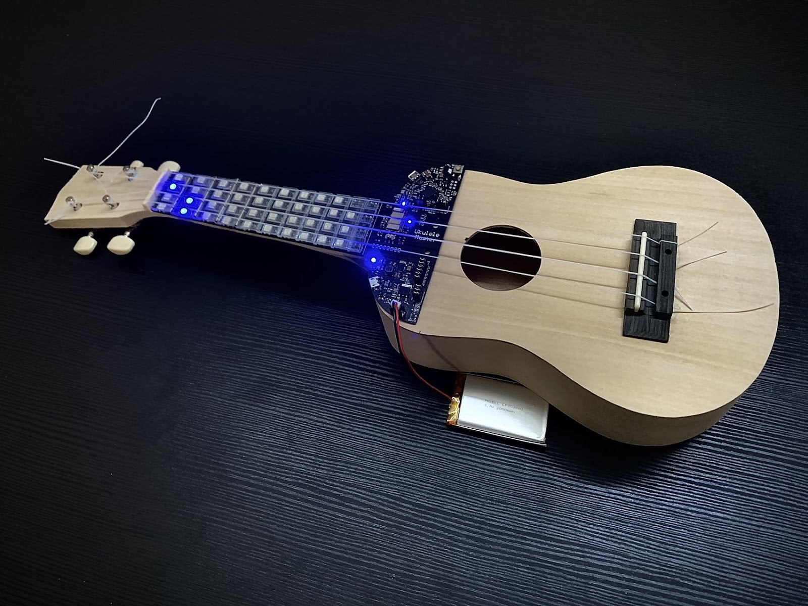

##[Home](index.md)
# Projects
# Ukulele Master
[Poster](Uke_Poster.jpg) &nbsp;[Report](Uke_Report.pdf)

For beginners, memorizing Ukulele chords are fundamental yet difficult. Repetition until muscle memory forms can work, but the process is tedious and people rarely have fun. That’s why the Ukulele can be hard to learn at the beginning.
  Ukulele Master is a real-world mobile music game that makes the learning process fun and easy. It incorporates a customized Ukulele with LEDs embedded in the fretboard, a mobile app that evaluates the user’s playing and gives instant feedback, and BLEs for the App-Ukulele communication. 
  The system was demonstrated at the CoE Design Expo. The app (user interaction & chord detection), hardware, and Bluetooth functioned well

# AI Liar's Dice
[Poster](AI_Liar_Dice_Poster.jpg) &nbsp; [Report](AI_DICE_Final_Report.pdf)

<!--   -->

The project is to implement an AI player in the [Liar’s dice game](https://www.youtube.com/watch?v=wbNzh25gI9Q). The goal is to let AI act as one of the players and do all the things that a player needs to do, such as roll the dice, read the dice faces,and make optimal claims to win against a human player.

# 8-Bit Dual-Mode Ripple-Carry Adder
[Report](Adder.pdf)

Final project of EECS312 Digital Integrated Circuit. 
