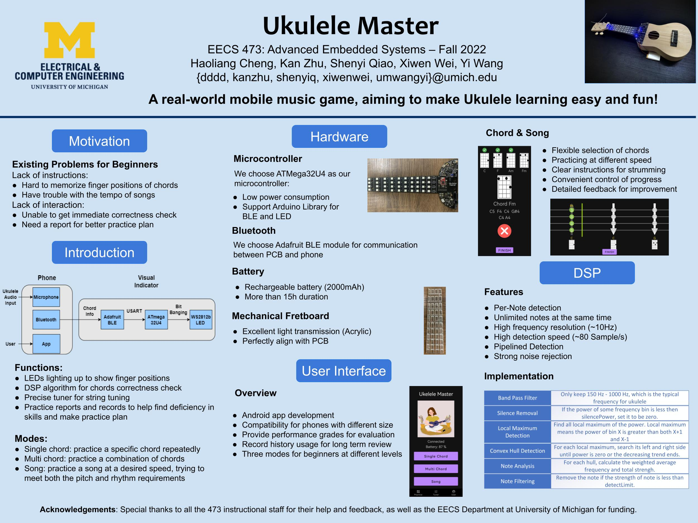
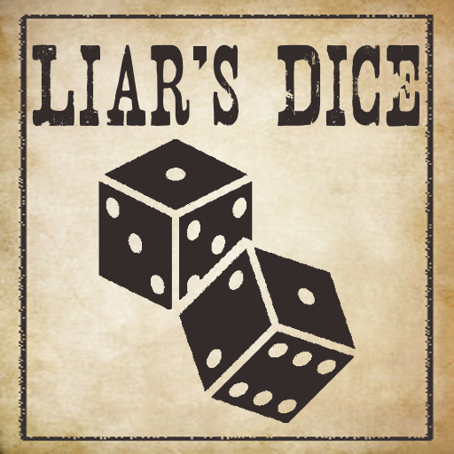

[Home](index.md)
# Projects
## Ukulele Master

[Report](Uke_Report.pdf)

## AI Liar's Dice
[Poster](AI_Liar_Dice_Poster.jpg) &nbsp; [Report](AI_DICE_Final_Report.pdf)

<!--   -->

A real-world human-AI game. The computer is able to shake the dice cup & see its dice!

## 8-Bit Dual-Mode Ripple-Carry Adder
[Report](Adder.pdf)

Final project of "Digital Integrated Circuit". 
