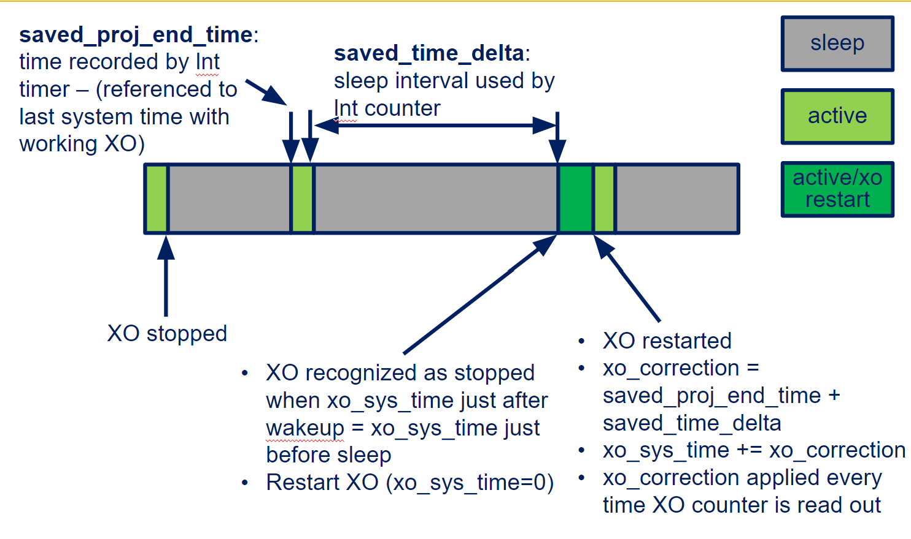

## [Home](index.md)
# Research
# [M3 Monarch Challenge](https://monarch.engin.umich.edu/)
*Advisor: [David Blaauw](https://blaauw.engin.umich.edu/)*\
\
 
1. Troubleshot the crystal timer failure and reduced the sensors’ error by 90%.
2. Implemented & tested a PID controller to calibrate a compensation timer.
3. Gained experience working with embedded software developing, hardware debugging and miniature ultra-low-powered sensing platform. 

# [Parametric Human Model for Mobility Safety](https://mdp.engin.umich.edu/research_teams/adaptive-design-23/)
*Advisor: [Jingwen Hu](https://www.umtri.umich.edu/people/hu-jingwen/) &nbsp; [Monica Jones](https://www.umtri.umich.edu/people/jones-monica/)*\
\
 
1. Processed and landmarked medical images using image processing software (Mimics, HyperMesh) to quantify the 3D geometries of cervical spine. 
2. Built statistical models using MATLAB and conducted mesh morphing to change a baseline model into personalized geometry targets.\
[Report](W22_C-Spine_Subteam_Final_Report.pdf)
